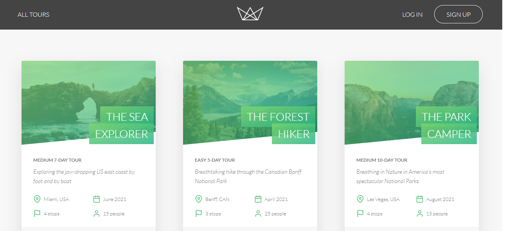

# Natours Web App

A Web App of a fictitious Tour company build with NodeJS runtime engine, pug's technology and various JavaScript libraries for authentication, authorization and so much more, following the guide in the Udemy course "Node.js, Express, MongoDB & More: The Complete Bootcamp 2020" created by Jonas Schmedtmann.

## Built With
- HTML
- CSS
- Javascript
- NodeJS
- The following libraries:
- babel/polyfill
- axios
- bcryptjs
- cookie-parser
- dotenv
- eslint-plugin-react-hooks
- express
- express-mongo-sanitize
- express-rate-limit
- helmet
- hpp
- jsonwebtoken
- mongoose
- morgan
- nodemailer
- pug
- slugify
- validator
- xss-clean

## Authors
### Author1
- 👤GitHub: [Jose Abel Ramirez](https://github.com/jose-Abel)

## Getting Started
You can clone this code anytime and so far you can load the Web App on your browser through the local port 3000. Since it was build with NodeJS it's require the installation of the npm modules listed in the package.json in the dependencies section.

## Live version
Soon

### Setup
You can either copy the code with git clone or just do a git pull on your local environment. In order to run this web app locally you have to do "npm install" so npm can install all libraries included in the package.json file and then run "npm run start".

### Acknowledgments
Appreciate the teams at Udemy and the creator of the course Jonas Schmedtmann since allows me to learn a lot of NodeJS concepts and design principles that is pushing my software development career higher.

## 📝 License
This project is MIT licensed.

## Show your support
Give a ⭐️ if you like this project!